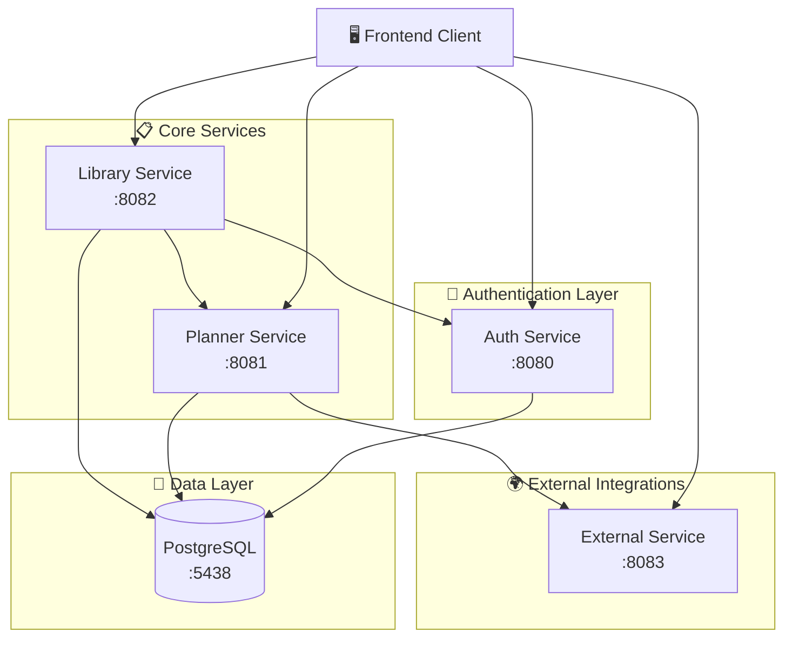
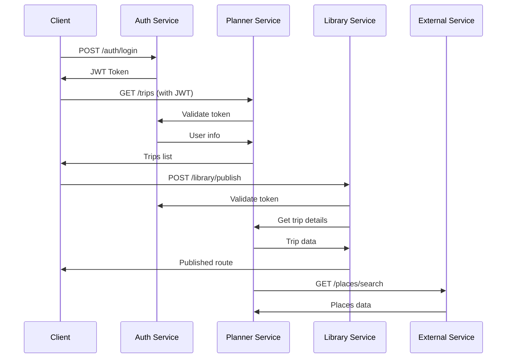

# 🧳 Travel Planner App - Backend

<div align="center">


**Микросервисная архитектура для планирования путешествий**

</div>

## 📋 Содержание

- [🏗️ Архитектура](#️-архитектура)
- [🚀 Сервисы](#-сервисы)
  - [🔐 Auth Service](#-auth-service)
  - [📋 Planner Service](#-planner-service)
  - [🌍 External Service](#-external-service)
  - [📚 Library Service](#-library-service)
- [🛠️ Технологии](#️-технологии)
- [🚀 Быстрый старт](#-быстрый-старт)
- [📊 База данных](#-база-данных)
- [📖 API Документация](#-api-документация)
- [🧪 Тестирование](#-тестирование)

## 🏗️ Архитектура

Приложение построено на микросервисной архитектуре с использованием Spring Boot и состоит из четырех основных сервисов:



## 🚀 Сервисы

### 🔐 Auth Service
**Порт:** `8080` | **Модуль:** `auth`

Сервис аутентификации и авторизации пользователей.

#### 🎯 Основные функции:
- 👤 Регистрация и авторизация пользователей
- 🔑 JWT токены (Access & Refresh)
- ✉️ Подтверждение email
- 🔄 Восстановление пароля
- 🛡️ Валидация токенов для других сервисов

#### 🔧 Технологии:
- **Spring Security** - безопасность
- **JWT (JJWT)** - токены аутентификации
- **Spring Mail** - отправка email
- **PostgreSQL** - хранение пользователей

#### 📡 API Endpoints:
```
POST /api/v1/auth/register          # Регистрация
POST /api/v1/auth/login             # Вход
POST /api/v1/auth/refresh           # Обновление токена
POST /api/v1/auth/verify-email      # Подтверждение email
POST /api/v1/auth/forgot-password   # Восстановление пароля
POST /api/v1/auth/validate-token    # Валидация токена
```

---

### 📋 Planner Service
**Порт:** `8081` | **Модуль:** `planner`

Основной сервис планирования путешествий и управления задачами.

#### 🎯 Основные функции:
- 🗺️ Создание и управление поездками
- ✅ Todo-списки и задачи
- 📁 Управление файлами
- 🔔 Система уведомлений
- 📋 Шаблоны задач
- ⏰ Планировщик задач

#### 🔧 Технологии:
- **MapStruct** - маппинг объектов
- **Spring Scheduler** - планировщик задач
- **Spring WebFlux** - реактивные HTTP клиенты
- **PostgreSQL** - основная БД

#### 📡 API Endpoints:
```
# Поездки
GET    /api/v1/trips              # Список поездок
POST   /api/v1/trips              # Создание поездки
GET    /api/v1/trips/{id}         # Детали поездки
PUT    /api/v1/trips/{id}         # Обновление поездки
DELETE /api/v1/trips/{id}         # Удаление поездки

# Todo-списки
GET    /api/v1/todo-lists         # Списки задач
POST   /api/v1/todo-lists         # Создание списка
PUT    /api/v1/todo-lists/{id}    # Обновление списка

# Файлы
POST   /api/v1/files/upload       # Загрузка файла
GET    /api/v1/files/{id}         # Скачивание файла

# Уведомления
GET    /api/v1/notifications      # Список уведомлений
PUT    /api/v1/notifications/{id} # Отметить как прочитанное

# Шаблоны
GET    /api/v1/templates          # Шаблоны задач
```

---

### 🌍 External Service
**Порт:** `8083` | **Модуль:** `external`

Сервис интеграции с внешними API и ИИ-сервисами.

#### 🎯 Основные функции:
- 🗺️ Поиск мест через внешние API
- 🤖 ИИ-генерация списков вещей
- 🖼️ Поиск изображений
- 📍 Автодополнение мест
- 🎒 Умные рекомендации для путешествий

#### 🔧 Технологии:
- **Spring WebFlux** - асинхронные HTTP клиенты
- **OpenAPI/Swagger** - документация API
- **Spring Security** - защита эндпоинтов

#### 📡 API Endpoints:
```
# Места
GET /api/v1/places/search         # Поиск мест
GET /api/v1/places/{id}           # Детали места
GET /api/v1/places/autocomplete   # Автодополнение

# ИИ сервисы
POST /api/v1/ai/packing-list      # Генерация списка вещей
GET  /api/v1/ai/templates         # Шаблоны списков
POST /api/v1/ai/trip-list         # ИИ-рекомендации поездок

# Изображения
GET /api/v1/images/search         # Поиск изображений
```

---

### 📚 Library Service
**Порт:** `8082` | **Модуль:** `library`

Сервис публичной библиотеки маршрутов и отзывов.

#### 🎯 Основные функции:
- 📖 Публичная библиотека маршрутов
- ⭐ Система отзывов и рейтингов
- 🔍 Поиск и фильтрация маршрутов
- 📊 Статистика популярности
- 🔗 Интеграция с Planner Service

#### 🔧 Технологии:
- **Spring Data JPA** - работа с БД
- **JWT** - аутентификация
- **Spring WebFlux** - HTTP клиенты
- **PostgreSQL** - хранение данных

#### 📡 API Endpoints:
```
# Библиотека маршрутов
GET    /api/v1/library/routes     # Публичные маршруты
GET    /api/v1/library/routes/{id} # Детали маршрута
POST   /api/v1/library/publish    # Публикация маршрута
DELETE /api/v1/library/routes/{id} # Удаление из библиотеки

# Отзывы
GET    /api/v1/reviews            # Отзывы о маршруте
POST   /api/v1/reviews            # Создание отзыва
PUT    /api/v1/reviews/{id}       # Обновление отзыва
DELETE /api/v1/reviews/{id}       # Удаление отзыва
```

## 🛠️ Технологии

### Backend Stack
- **Java 23** - основной язык программирования
- **Spring Boot 3.4.4** - фреймворк приложения
- **Spring Security** - безопасность
- **Spring Data JPA** - работа с БД
- **Spring WebFlux** - реактивное программирование
- **PostgreSQL 17** - основная база данных
- **Liquibase** - миграции БД
- **Maven** - сборка проекта

### Дополнительные библиотеки
- **Lombok** - упрощение кода
- **MapStruct** - маппинг объектов
- **JWT (JJWT)** - JSON Web Tokens
- **SpringDoc OpenAPI** - документация API
- **TestContainers** - интеграционные тесты

## 🚀 Быстрый старт

### Предварительные требования
- ☕ Java 23+
- 🐘 PostgreSQL 17
- 🐳 Docker & Docker Compose
- 📦 Maven 3.9+

### 1. Клонирование репозитория
```bash
git clone <repository-url>
cd travelPlannerApp
```

### 2. Настройка переменных окружения
Создайте файл `.env`:
```env
DB_USERNAME=postgres
DB_PASSWORD=postgres
```

### 3. Запуск базы данных
```bash
docker-compose up postgresql liquibase-migrations
```

### 4. Сборка проекта
```bash
mvn clean install
```

### 5. Запуск сервисов
```bash
# Auth Service
cd auth && mvn spring-boot:run

# Planner Service  
cd planner && mvn spring-boot:run

# External Service
cd external && mvn spring-boot:run

# Library Service
cd library && mvn spring-boot:run
```

## 📊 База данных

### Схема подключения
- **Host:** `localhost`
- **Port:** `5438`
- **Database:** `travelPlannerDB`
- **Username:** `postgres`
- **Password:** `postgres`

### Миграции
Миграции выполняются автоматически через **Liquibase** при запуске контейнера:
```bash
docker-compose up liquibase-migrations
```

Файлы миграций находятся в папке `migrations/`.

## 📖 API Документация

Каждый сервис предоставляет Swagger UI документацию:

| Сервис | Swagger UI |
|--------|------------|
| 🔐 Auth | http://localhost:8080/swagger-ui.html |
| 📋 Planner | http://localhost:8081/swagger-ui.html |
| �� External | http://localhost:8083/swagger-ui.html |
| 📚 Library | http://localhost:8082/swagger-ui.html |

### Аутентификация
Большинство эндпоинтов требуют JWT токен в заголовке:
```
Authorization: Bearer <your-jwt-token>
```

## 🧪 Тестирование

### Запуск тестов
```bash
# Все тесты
mvn test

# Тесты конкретного модуля
cd auth && mvn test
cd planner && mvn test
cd external && mvn test
cd library && mvn test
```

### Типы тестов
- **Unit тесты** - тестирование отдельных компонентов
- **Integration тесты** - тестирование с TestContainers
- **API тесты** - тестирование REST эндпоинтов

## 🔧 Конфигурация

### Порты сервисов
| Сервис | Порт |
|--------|------|
| Auth Service | 8080 |
| Planner Service | 8081 |
| Library Service | 8082 |
| External Service | 8083 |
| PostgreSQL | 5438 |

### Профили Spring
- `dev` - разработка
- `test` - тестирование
- `prod` - продакшн

## 🤝 Взаимодействие сервисов



## 📝 Лицензия

Этот проект разработан для образовательных целей.

---

<div align="center">

**🧳 Travel Planner App** - Планируйте путешествия с умом!

Made with ❤️ using Spring Boot

</div>
